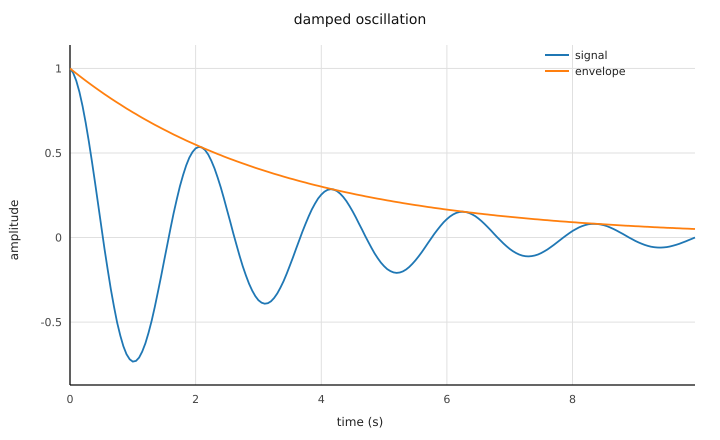

# 9 — Preparing data for plotting

The end of most analyses is a figure, and figures are where
reproducibility quietly dies: a plotting daemon, a font cache, a
library version, and yesterday's PNG differs from today's for no
scientific reason.  `Plot` renders SVG as a STRING — pure
computation, deterministic to the byte: the same program produces
the same figure, byte for byte, on any machine, and this page's own
build verifies exactly that for the figure below.  A figure you can
`cmp` is a figure you can trust in CI.

```m9 C9Plot.m9
MODULE C9Plot ;

(* Chapter 9.  From numbers to a figure: Plot renders SVG as a
   STRING -- deterministic bytes, which is why the repository can
   hold plots to byte-identity against a Modula-2 oracle.  Here: a
   damped oscillation and its envelope, two labelled series, one
   file, no plotting daemon anywhere.

   Plot is the corpus' one STATEFUL module: AddLine accumulates
   into a module-level figure, which is why the definition says
   STATEFUL and a thread may not touch it while another draws.      *)

IMPORT Io ;
IMPORT Math ;
IMPORT Plot ;

CONST
  N = 200 ;

VAR
  pool   : POOL ;
  xs     : ARRAY 200 OF F64 ;
  ys, es : ARRAY 200 OF F64 ;
  i      : I64 ;
  t      : F64 ;
  svg    : STR ;

BEGIN
  FOR i := 0 TO N - 1 DO
    t := F64 (i) * 0.05 ;
    xs [i] := t ;
    es [i] := Math.Exp (0.0 - 0.3 * t) ;
    ys [i] := es [i] * Math.Cos (3.0 * t)
  END ;
  Plot.ClearFigure () ;
  Plot.AddLine (xs, ys, 0, 'signal') ;
  Plot.AddLine (xs, es, 1, 'envelope') ;
  svg := Plot.Render (pool, 'damped oscillation', 'time (s)', 'amplitude') ;
  Io.WriteFile ('/tmp/damped.svg', svg) ;
  Io.Write ('wrote /tmp/damped.svg, ') ;
  Io.WriteI64 (LEN (svg)) ;
  Io.WriteLine (' bytes')
EXCEPT
| ValueRange :
    Io.ErrLine ('rendering failed') ; Io.Halt (1)
| Overflow :
    Io.ErrLine ('overflow in the series') ; Io.Halt (1)
| Io.IOError :
    Io.ErrLine ('cannot write /tmp/damped.svg') ; Io.Halt (1)
END C9Plot.
```

```output C9Plot
wrote /tmp/damped.svg, 7847 bytes
```



The API is the smallest one that earns its keep: `ClearFigure`,
`AddLine (xs, ys, colorIndex, label)` up to four labelled series,
`Render (pool, title, xlabel, ylabel)` — axes scaled and ticked
with the same "nice step" rule everywhere, NaN points simply
breaking the line (a gap in the data is a gap in the plot, per
chapter 5).  `RenderHeat` does the same for a matrix.  The result
is a string because chapter 5 already gave us the file boundary:
`Io.WriteFile`, one checked call.

Run here, the figure appears as a link under the output — the
sandbox keeps what a cell writes to its `/tmp` and serves it back.
Run locally, open `/tmp/damped.svg` in any browser.  Either way
there is no step in which a plotting server, a GUI toolkit or a
locale was consulted; the bytes are the bytes.

## Where you are now

Eight programs ago the language was a stranger.  What you have
seen: programs whose imports, widths, failure modes, ownership and
thread discipline are all in the source and all checked; a CSV
reader that believes the file's documentation instead of guessing;
statistics with scipy behind every digit; timeseries whose
resolution and convention are data; a chunked-store reader whose
use-after-close is uncompilable; and figures that diff.  None of it
was convenient to write.  All of it is convenient to REVIEW — and
review, not writing, is where scientific software spends its life.

The reference for every module these chapters used is generated
from the definitions themselves (`m9c --doc`) and ships with the
compiler: `DynStr`, `Io`, `Fmt`, `Time`, `Csv`, `Stats`, `Mat`,
`Math`, `Frame`, `ZarrStore`, `NetCDF`, `Parquet`, `Plot` and the
rest.  The repository's `museum/` directory is the language's
design rationale in executable form.  And every example you just
read runs, verbatim, on every commit — if this page and the
compiler ever disagree, the build breaks before you can read the
lie.

[← Previous: data through zarr](08-zarr.md) · [Next: a real dataset →](10-real-data.md)
