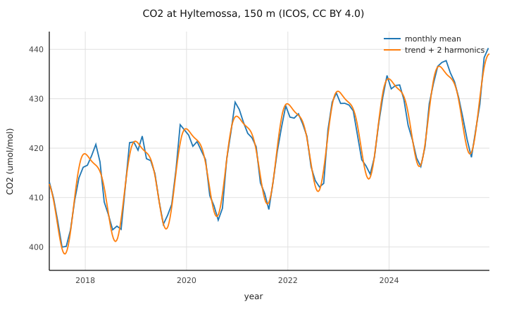

# 10 — A real dataset, end to end

Everything the eight chapters built, on real data: nine years of
hourly CO2 measured 150 m above the forest at the ICOS station
Hyltemossa (HTM, southern Sweden), read straight out of the Carbon
Portal's zarr service, quality-controlled by the station's own
flags, decomposed by ordinary least squares into a linear trend
plus annual and semiannual harmonics, and plotted.

The data is the ICOS ObsPack collection (CC BY 4.0,
[doi:10.18160/JZ2X-GZGU](https://doi.org/10.18160/JZ2X-GZGU)),
served at `zarr.icos-cp.eu`.  The sandbox behind this page serves a
**raw byte mirror** of the three HTM arrays — the portal's own
objects, undecoded — so the program below runs here without
network, and runs unchanged on your machine against the live
service:

    m9c --make -c C10Icos.m9
    cc C10Icos.o ZarrStore.o Json.o Http.o Mat.o Math.o Plot.o \
       DynStr.o Io.o Fmt.o m9rt.c tcpshim.c tlsshim.c fmtshim.c \
       -lblosc -lssl -lcrypto -lm -o co2fit
    ./co2fit https://zarr.icos-cp.eu/icos-obspack.zarr

Same bytes in, same numbers out — that is what the mirror being the
live store's own objects buys.

```m9 C10Icos.m9
MODULE C10Icos ;

(* Chapter 10.  The capstone: nine years of real hourly CO2 from the
   ICOS station Hyltemossa (HTM, southern Sweden), measured 150 m
   above the forest, read straight out of the Carbon Portal's zarr
   service and decomposed with ordinary least squares into a linear
   trend plus annual and semiannual harmonics -- a Fourier fit:

     co2(t) ~ c0 + c1 t + c2 cos 2pi t + c3 sin 2pi t
                       + c4 cos 4pi t + c5 sin 4pi t

   The sandbox serves a raw byte MIRROR of the same store, so this
   program runs unchanged against the live service:

     ./c9 https://zarr.icos-cp.eu/icos-obspack.zarr

   Quality control is the ATC convention the store itself documents:
   keep an hour when its flag is 'U' or 'O'.  The normal equations
   are accumulated in one pass, solved by Cholesky, and the result
   plotted like chapter 9: every QC-passed hour a small black dot,
   monthly means and the fitted curve drawn over them.

   Data: ICOS ObsPack collection, CC BY 4.0,
   doi:10.18160/JZ2X-GZGU.                                          *)

IMPORT Io ;
IMPORT Fmt ;
IMPORT Math ;
IMPORT Mat ;
IMPORT Plot ;
IMPORT ZarrStore ;

CONST
  Lo     = 2017.25 ;         (* the fit window: 2017-2025.  The live
                                store grows past it; the window is
                                what makes a live run comparable to
                                the recorded one *)
  Hi     = 2026.0 ;
  Mid    = 2021.5 ;          (* centre time: a well-behaved matrix *)
  Months = 105 ;             (* 1/12-year bins across the window   *)
  FitPts = 420 ;             (* the fitted curve, ~4 points/month  *)
  YearSec = 31556952.0 ;     (* mean Gregorian year: decimal years
                                from POSIX seconds, exact enough
                                that the phase moves under a day *)

PROCEDURE At (VAR arr: PTR ZarrStore.Array ; i: I64) : F64
  RAISES ZarrStore.IOError =
  (* element i of a 1-D array, checked against the store's shape.

       arr -- VAR because a read can grow the chunk cache.
       i   -- 0-based; out of range raises IndexError, always.      *)
VAR ix : ARRAY 1 OF I64 ;
BEGIN
  ix [0] := i ;
  RETURN ZarrStore.GetF64 (arr, ix)
END At ;

PROCEDURE AtI (VAR arr: PTR ZarrStore.Array ; i: I64) : I64
  RAISES ZarrStore.IOError, ValueRange =
  (* the integer twin: ValueRange is the store handing back
     something an I64 cannot hold -- declared, because chapter 2. *)
VAR ix : ARRAY 1 OF I64 ;
BEGIN
  ix [0] := i ;
  RETURN ZarrStore.GetI64 (arr, ix)
END AtI ;

PROCEDURE Model (RO c: SLICE OF F64 ; t: F64) : F64
  RAISES ValueRange, Overflow, IndexError =
  (* the fitted curve at one time.

       c -- the six coefficients, in the order the design matrix
            declared them: constant, slope, annual cos/sin,
            semiannual cos/sin.
       t -- years relative to Mid, the fit's own time axis.         *)
BEGIN
  RETURN c [0] + c [1] * t
       + c [2] * Math.Cos (2.0 * Math.Pi * t)
       + c [3] * Math.Sin (2.0 * Math.Pi * t)
       + c [4] * Math.Cos (4.0 * Math.Pi * t)
       + c [5] * Math.Sin (4.0 * Math.Pi * t)
END Model ;

VAR
  pool : POOL ;
  st   : SHARED PTR ZarrStore.Store ;
  ay, ac, aq : PTR ZarrStore.Array ;
  url  : STR ;
  xtx, rhs, low, sol : PTR Mat.Matrix ;
  b    : ARRAY 6 OF F64 ;
  coef : ARRAY 6 OF F64 ;
  mSum : ARRAY 105 OF F64 ;
  mN   : ARRAY 105 OF I64 ;
  mx, my : ARRAY 105 OF F64 ;
  hx, hy : SLICE OF F64 ;
  fx, fy : ARRAY 420 OF F64 ;
  n, i, j, k, valid, mo, nm, flag : I64 ;
  y, v, t, amp1, amp2 : F64 ;
  svg  : STR ;

BEGIN
  IF Io.ArgCount () > 1 THEN
    url := Io.Arg (pool, 1)
  ELSE
    url := 'http://127.0.0.1:18931/icos-obspack.zarr'
  END ;
  st := ZarrStore.Open (url) ;
  ay := ZarrStore.OpenArray (st, 'HTM150/time_co2') ;
  ac := ZarrStore.OpenArray (st, 'HTM150/co2') ;
  aq := ZarrStore.OpenArray (st, 'HTM150/co2_qc_flag') ;
  n := ZarrStore.Extent (ac, 0) ;

  xtx := Mat.New (pool, 6, 6) ;
  rhs := Mat.New (pool, 6, 1) ;
  hx := NEW (pool, F64, n) ;      (* the hours themselves, plotted *)
  hy := NEW (pool, F64, n) ;
  valid := 0 ;
  FOR i := 0 TO n - 1 DO
    v := At (ac, i) ;
    flag := AtI (aq, i) ;               (* 'U'/'O' = usable, ATC *)
    IF v = v AND (flag = ORD ('U') OR flag = ORD ('O')) THEN
      y := 1970.0 + F64 (AtI (ay, i)) / YearSec ;
      IF y >= Lo AND y < Hi THEN
      t := y - Mid ;
      b [0] := 1.0 ;
      b [1] := t ;
      b [2] := Math.Cos (2.0 * Math.Pi * t) ;
      b [3] := Math.Sin (2.0 * Math.Pi * t) ;
      b [4] := Math.Cos (4.0 * Math.Pi * t) ;
      b [5] := Math.Sin (4.0 * Math.Pi * t) ;
      FOR j := 0 TO 5 DO
        FOR k := 0 TO 5 DO
          Mat.Set (xtx, j, k, Mat.Get (xtx, j, k) + b [j] * b [k])
        END ;
        Mat.Set (rhs, j, 0, Mat.Get (rhs, j, 0) + b [j] * v)
      END ;
      hx [valid] := y ;
      hy [valid] := v ;
      (* monthly bin for the plot *)
      mo := I64 (Math.Floor ((y - Lo) * 12.0)) ;
      IF mo >= 0 AND mo < Months THEN
        mSum [mo] := mSum [mo] + v ;
        mN [mo] := mN [mo] + 1
      END ;
      valid := valid + 1
      END
    END
  END ;

  low := Mat.Cholesky (pool, xtx) ;
  sol := Mat.CholSolve (pool, low, rhs) ;
  FOR j := 0 TO 5 DO coef [j] := Mat.Get (sol, j, 0) END ;
  amp1 := Math.Sqrt (coef [2] * coef [2] + coef [3] * coef [3]) ;
  amp2 := Math.Sqrt (coef [4] * coef [4] + coef [5] * coef [5]) ;

  Io.Write ('hours in the window ') ;
  Io.WriteI64 (valid) ;
  Io.WriteLine (' (of ' + Fmt.I64Str (pool, n) + ' in the store)') ;
  Io.WriteLine ('mean 2021.5        ' +
                Fmt.Fixed (pool, coef [0], 2) + ' umol/mol') ;
  Io.WriteLine ('trend              ' +
                Fmt.Fixed (pool, coef [1], 3) + ' umol/mol per year') ;
  Io.WriteLine ('annual amplitude   ' +
                Fmt.Fixed (pool, amp1, 2) + ' (peak to trough ' +
                Fmt.Fixed (pool, 2.0 * amp1, 2) + ')') ;
  Io.WriteLine ('semiannual         ' +
                Fmt.Fixed (pool, amp2, 2)) ;

  nm := 0 ;
  FOR i := 0 TO Months - 1 DO
    IF mN [i] > 0 THEN
      mx [nm] := Lo + (F64 (i) + 0.5) / 12.0 ;
      my [nm] := mSum [i] / F64 (mN [i]) ;
      nm := nm + 1
    END
  END ;
  FOR i := 0 TO FitPts - 1 DO
    y := 2017.29 + F64 (i) * (Hi - 2017.29) / F64 (FitPts) ;
    fx [i] := y ;
    fy [i] := Model (coef, y - Mid)
  END ;
  Plot.ClearFigure () ;
  Plot.SetDots (SLICE (hx, 0, valid), SLICE (hy, 0, valid)) ;
  Plot.AddLine (SLICE (mx, 0, nm), SLICE (my, 0, nm), 0, 'monthly mean') ;
  Plot.AddLine (fx, fy, 1, 'trend + 2 harmonics') ;
  svg := Plot.Render (pool, 'CO2 at Hyltemossa, 150 m (ICOS, CC BY 4.0)',
                      'year', 'CO2 (umol/mol)') ;
  Io.WriteFile ('/tmp/htm.svg', svg) ;
  Io.Write ('wrote /tmp/htm.svg, ') ;
  Io.WriteI64 (LEN (svg)) ;
  Io.WriteLine (' bytes')
EXCEPT
| ZarrStore.IOError :
    Io.ErrLine ('store unreachable -- is the local server running?') ;
    Io.Halt (1)
| ZarrStore.FormatError (what) :
    Io.ErrLine ('not a zarr v2 store') ;
    Io.Halt (1)
| Mat.NotSPD (row) :
    Io.ErrLine ('normal equations not positive definite') ;
    Io.Halt (1)
| Mat.SizeError (a, bb) :
    Io.ErrLine ('matrix sizes disagree') ;
    Io.Halt (1)
| ValueRange :
    Io.ErrLine ('a value did not fit') ;
    Io.Halt (1)
| Overflow :
    Io.ErrLine ('overflow') ;
    Io.Halt (1)
| IndexError :
    Io.ErrLine ('index out of range') ;
    Io.Halt (1)
| Io.IOError (p) :
    Io.ErrLine ('cannot write /tmp/htm.svg') ;
    Io.Halt (1)
END C10Icos.
```

```output C10Icos
hours in the window 72456 (of 84672 in the store)
mean 2021.5        419.92 umol/mol
trend              2.529 umol/mol per year
annual amplitude   9.01 (peak to trough 18.02)
semiannual         2.62
wrote /tmp/htm.svg, 3748547 bytes
```




What the numbers say: CO2 at Hyltemossa climbs about 2.5 umol/mol a
year, and the forest breathes an 18 umol/mol seasonal swing around
that climb — summer drawdown, winter release — with a semiannual
correction of a couple of umol/mol shaping the shoulders.  The plot
draws every QC-passed hour as a small black dot, with the monthly
means and the six-coefficient fit over them — nine years of raw
observations and their summary in one picture.

Worth noticing on the way out:

- **The quality control is the station's.**  `co2_qc_flag` carries
  the ATC convention the store itself documents — keep `'U'` and
  `'O'` — and the flag array is read like any other: a one-byte
  categorical is a byte, and `ORD ('U')` is a number.
- **The gaps cost one visible line.**  A NaN hour fails `v = v` and
  is simply not a row of the least squares — chapter 6's rule,
  at 72,456 rows.
- **The normal equations are six-by-six** whatever the row count:
  one pass accumulates them, `Mat.Cholesky` + `Mat.CholSolve`
  answer the coefficients, and the condition number is kept honest
  by centring time on 2021.5.
- **Nothing here is a notebook.**  It is a checked program: every
  fetch validated against the store's own metadata, every failure
  mode in the signatures, and the figure a deterministic SVG you
  can `cmp`.

[← Previous: preparing data for plotting](09-plotting.md)

[Next: threads, waiting in parallel →](11-threads.md)
