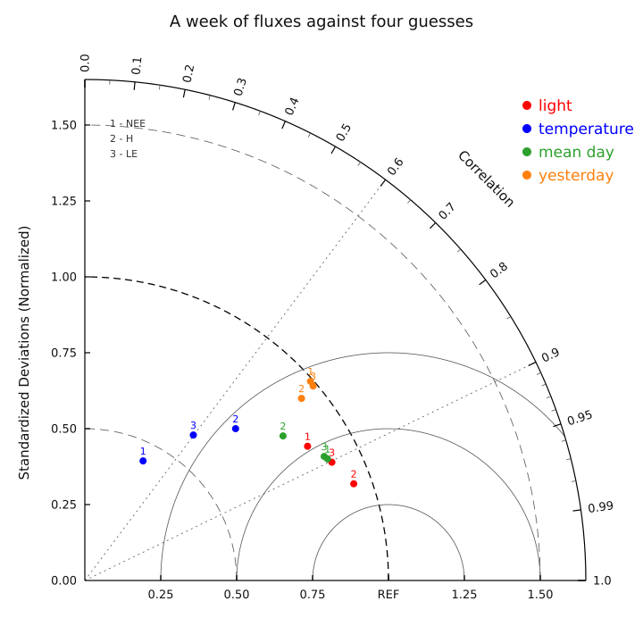

# 18. Evaluating a model: a Taylor diagram, a regression as matrices, and its residuals

Chapter 15 asked whether NEE depends on temperature. This chapter asks
the questions that come after a model exists: how good is it, compared
with the alternatives? How sure are we of its coefficients? And do its
errors behave the way the uncertainty assumed? Three programs, the
same week of half-hourly fluxes from chapter 14, and three corners of
the library that came with 0.14: `Stats.Taylor` and
`Plot.RenderTaylor`, the general linear algebra in `Mat`, and the
probability distributions in `Stats`. Every number on this page is
also held to numpy and scipy by the repository's own oracles.

## How good is a guess: the Taylor diagram

A model and its observations differ in three ways that a single error
number blurs together: the model can vary too little or too much, it
can go up when the observations go down, and it can do both at once.
Karl Taylor's diagram (2001) separates them. Each comparison becomes
one point: its distance from the origin is the ratio of the model's
standard deviation to the observations', its angle is their
correlation, and its distance from the point marked REF — the
observations compared with themselves — is the root-mean-square
difference that is left. One figure holds a whole evaluation.

The "models" here are four predictions anyone could make without a
model: a straight line on incoming light, a straight line on air
temperature, the week's average day, and simply what happened at the
same time yesterday. Each predicts three fluxes: NEE, sensible heat
(H) and latent heat, the evaporation (LE).

```m9 C18Taylor.m9
MODULE C18Taylor ;

(* Chapter 18: how good is a model, in one picture.

   A Taylor diagram places every comparison of a model with its
   observations by two numbers: how much the model VARIES compared
   with the observations (the ratio of the two standard deviations,
   the distance from the origin) and how well it goes up and down
   WITH them (the correlation, the angle).  The distance from the
   point to REF, the observations themselves, is then the centred
   root-mean-square difference -- the third number, for free.

   The observations are chapter 14's week of half-hourly fluxes: net
   ecosystem exchange (NEE), sensible heat (H) and latent heat (LE).
   The "models" are four predictions anyone could make without a
   model at all:
     light        a straight line on incoming shortwave light,
     temperature  a straight line on air temperature,
     mean day     the week's average of each half-hour of the day,
                  the same 48 values seven times,
     yesterday    each half-hour as it was 24 hours before.
   Each is held against the same observations, and the figure shows
   which kind of knowledge each flux needs.                          *)

IMPORT Io ;
IMPORT Faults ;
IMPORT Fmt ;
IMPORT Csv ;
IMPORT Math ;
IMPORT Stats ;
IMPORT Plot ;

CONST
  Default = 'data/fluxnet_week.csv' ;
  PerDay = 48 ;                (* half-hours in a day *)
  Figure = '/tmp/taylor.svg' ;
  Columns = ['NEE_VUT_REF', 'H_F_MDS', 'LE_F_MDS'] ;
  Fluxes = ['NEE', 'H', 'LE'] ;
  Models = ['light', 'temperature', 'mean day', 'yesterday'] ;
                               (* the legend has room for about twelve
                                  characters a name *)

(* the column of that name, declared a 64-bit real before the parse;
   a file without it stops the program, naming what was missing *)
PROCEDURE Real (VAR t: PTR Csv.Table ; RO name: STR) : I64 =
VAR c : I64 ;
BEGIN
  c := Csv.Find (t, name) ;
  IF c >= 0 THEN
    Csv.SetReal64 (t, c)
  ELSE
    Io.ErrLine ('the file has no column ' + name) ;
    Io.Halt (1)
  END ;
  RETURN c
END Real ;

(* model 1 and 2: the least-squares line of y on the driver x, and
   what it says at every x *)
PROCEDURE Line (RO x, y: SLICE OF F64 ; VAR m: SLICE OF F64)
  RAISES Stats.TooFew, ValueRange, Overflow =
VAR
  reg : Stats.Reg ;
  i : I64 ;
BEGIN
  reg := Stats.LinReg (x, y) ;
  FOR i := 0 TO LEN (y) - 1 DO
    m[i] := reg.intercept + reg.slope * x[i]
  END
END Line ;

(* model 3: every half-hour of the day averaged over the days, and
   that average day repeated *)
PROCEDURE MeanDay (RO y: SLICE OF F64 ; VAR m: SLICE OF F64)
  RAISES ValueRange =
VAR
  days, k, d : I64 ;
  s : F64 ;
BEGIN
  days := LEN (y) DIV PerDay ;
  FOR k := 0 TO PerDay - 1 DO
    s := 0.0 ;
    FOR d := 0 TO days - 1 DO s := s + y[d * PerDay + k] END ;
    FOR d := 0 TO days - 1 DO m[d * PerDay + k] := s / F64 (days) END
  END
END MeanDay ;

(* model 4: the value 24 hours earlier.  The first day has no
   yesterday, so it is MISSING -- a NaN -- and Stats.Taylor compares
   the six days where both are present *)
PROCEDURE Yesterday (RO y: SLICE OF F64 ; VAR m: SLICE OF F64) =
VAR i : I64 ;
BEGIN
  FOR i := 0 TO LEN (y) - 1 DO
    IF i < PerDay THEN
      m[i] := 0.0 / 0.0
    ELSE
      m[i] := y[i - PerDay]
    END
  END
END Yesterday ;

(* s and blanks after it, to make a column of the table *)
PROCEDURE PadTo (RO s: STR ; width: I64) : STR =
VAR
  pad : STR ;
  i : I64 ;
BEGIN
  pad := '' ;
  FOR i := LEN (s) TO width - 1 DO pad := pad + ' ' END ;
  RETURN s + pad
END PadTo ;

VAR
  pool : POOL ;
  path, svg, msg : STR ;
  t : PTR Csv.Table IN pool ;
  cSw, cTa, f, k : I64 ;
  cols : SLICE OF I64 ;
  sw, ta, y, m : SLICE OF F64 ;
  ratio, corr : GRID 2 OF F64 ;
  r, c, e, worst : F64 ;

BEGIN
  path := Default ;
  IF Io.ArgCount () > 1 THEN path := Io.Arg (pool, 1) END ;

  (* ---- the two drivers and the three fluxes, nothing else ---- *)
  t := Csv.Open (pool, path, Csv.Defaults ()) ;
  cSw := Real (t, 'SW_IN_F') ;
  cTa := Real (t, 'TA_F') ;
  cols := NEW (pool, I64, LEN (Columns)) ;
  FOR f := 0 TO LEN (Columns) - 1 DO cols[f] := Real (t, Columns[f]) END ;
  Csv.Parse (pool, t) ;
  sw := Csv.ColF64 (t, cSw) ;
  ta := Csv.ColF64 (t, cTa) ;
  Io.WriteLine (Fmt.I64Str (LEN (sw)) + ' half-hours, '
                + Fmt.I64Str (LEN (sw) DIV PerDay) + ' days') ;
  Io.WriteLine ('') ;

  (* ---- each flux against each model: one ROW a model, one
     COLUMN a flux, as RenderTaylor takes them ---- *)
  ratio := NEW (pool, F64, LEN (Models), LEN (Fluxes)) ;
  corr := NEW (pool, F64, LEN (Models), LEN (Fluxes)) ;
  m := NEW (pool, F64, LEN (sw)) ;
  worst := 0.0 ;
  Io.WriteLine ('flux  model          ratio   corr    rms') ;
  FOR f := 0 TO LEN (Fluxes) - 1 DO
    y := Csv.ColF64 (t, cols[f]) ;
    FOR k := 0 TO LEN (Models) - 1 DO
      CASE k OF
      | 0 : Line (sw, y, m)
      | 1 : Line (ta, y, m)
      | 2 : MeanDay (y, m)
      ELSE  Yesterday (y, m)
      END ;
      Stats.Taylor (m, y, r, c, e) ;
      ratio[k, f] := r ;
      corr[k, f] := c ;
      Io.WriteLine (PadTo (Fluxes[f], 6) + PadTo (Models[k], 12)
                    + Fmt.FixedPad (r, 7, 3) + Fmt.FixedPad (c, 7, 3)
                    + Fmt.FixedPad (e, 7, 3)) ;
      (* the geometry the figure rests on: rms is the distance to
         REF, so it follows from the other two *)
      worst := Math.Max (worst, Math.Fabs (e * e - (r * r + 1.0 - 2.0 * r * c)))
    END
  END ;
  Io.WriteLine ('') ;
  IF worst < 1.0E-12 THEN
    Io.WriteLine ('rms * rms = ratio * ratio + 1 - 2 * ratio * corr, every row')
  ELSE
    Io.WriteLine ('the three numbers DISAGREE by ' + Fmt.Sci (worst, 2))
  END ;

  (* ---- the picture ---- *)
  svg := Plot.RenderTaylor ('A week of fluxes against four guesses',
                            ratio, corr, Models, Fluxes) ;
  Io.WriteFile (Figure, svg) ;
  Io.WriteLine ('wrote ' + Figure + ', ' + Fmt.I64Str (LEN (svg)) + ' bytes')
EXCEPT
| Csv.ParseError (what, line, col) :
    msg := what ;              (* a handler's binder has no type yet; a
                                  declared local gives it one *)
    Io.ErrLine (path + ':' + Fmt.I64Str (line) + ':' + Fmt.I64Str (col)
                + ': ' + msg) ;
    Io.Halt (1)
| Csv.RangeError (row, col) :
    Io.ErrLine ('a value out of range at row ' + Fmt.I64Str (row)) ;
    Io.Halt (1)
| Stats.TooFew (got, need) :
    Io.ErrLine ('too few values: ' + Fmt.I64Str (got)) ;
    Io.Halt (1)
| Faults.BadArg (what) :
    msg := what ;
    Io.ErrLine ('a flux that does not vary: ' + msg) ;
    Io.Halt (1)
| Faults.SizeError (got, want) :
    Io.ErrLine ('a model and its observations differ in length') ;
    Io.Halt (1)
| ValueRange :
    Io.ErrLine ('a value out of range') ; Io.Halt (1)
| Overflow :
    Io.ErrLine ('overflow') ; Io.Halt (1)
| Io.IOError :
    Io.ErrLine ('cannot read ' + path + ' or write ' + Figure) ;
    Io.Halt (1)
END C18Taylor.
```

```output C18Taylor
336 half-hours, 7 days

flux  model          ratio   corr    rms
NEE   light         0.857  0.857  0.516
NEE   temperature   0.438  0.438  0.899
NEE   mean day      0.894  0.894  0.448
NEE   yesterday     0.991  0.750  0.704
H     light         0.941  0.941  0.338
H     temperature   0.705  0.705  0.710
H     mean day      0.808  0.808  0.589
H     yesterday     0.932  0.765  0.665
LE    light         0.902  0.902  0.432
LE    temperature   0.598  0.598  0.802
LE    mean day      0.888  0.888  0.460
LE    yesterday     0.988  0.761  0.687

rms * rms = ratio * ratio + 1 - 2 * ratio * corr, every row
wrote /tmp/taylor.svg, 9595 bytes
```



**Reading it.** Light is the best single driver of H and LE: their
red points sit closest to REF, with correlations of 0.94 and 0.90.
For NEE the mean day does slightly better than light (0.894 against
0.857), because night-time respiration is not a function of light at
all, and the mean day knows what the nights look like. Temperature is
the weakest guess for all three; for NEE it explains less than a fifth
of the variance, the r² of chapter 15.

**A pattern worth knowing.** In every row the line on light, the line
on temperature and the mean day have a ratio *exactly* equal to their
correlation. That is no coincidence: all three are least-squares fits
to the observations they are compared with, and a least-squares fit is
shrunk towards the mean by exactly its correlation. On the diagram,
every such point lies on the half-circle whose diameter runs from the
origin to REF (not drawn, but you can see the red, blue and green
points arranged along it). Yesterday is not fitted: it carries the
full variance of the observations (ratio about 1, the dashed arc) and
pays for it in correlation, at about 0.76.

**Missing values.** Yesterday has no value for the first day, so
`Yesterday` writes a NaN there, and `Stats.Taylor` compares only the
pairs where both values are present — six days, not seven. Nobody had
to remember to cut the first 48 half-hours off both series.

**The caveat.** The two lines and the mean day were fitted to the same
week they are judged on, which flatters them. A fair evaluation fits
on one period and tests on another; the program would not change,
only the file.

`RenderTaylor` takes one *row* a model and one *column* a variable,
and the model and flux names are passed straight from their constant
tables: `CONST Models = ['light', ...]` is an array whose length is
its count, indexed with every index checked and lent to an `RO`
parameter (the report's §2.2.4).
The legend leaves room for about twelve characters a name, which is
why the models have short ones.

## A regression as matrices, and the inverse it needs

Chapter 15 used one driver. Several drivers at once is the same
problem written as matrices: one row of the design matrix X for each
half-hour, one column for each term, and the coefficients b that make
X b − y as small as possible.

```m9 C18Fit.m9
MODULE C18Fit ;

(* Chapter 18: a regression written as matrices -- net ecosystem
   exchange on light, temperature and the air's dryness at once --
   and the inverse a standard error needs.

   The model is NEE = b0 + b1 SW + b2 TA + b3 VPD, one ROW of the
   design matrix X a half-hour and one COLUMN a term:

       X = [ 1  SW  TA  VPD ]          y = [ NEE ]

   Mat.LstSq finds the b that makes X b - y smallest.  The
   uncertainty of b needs the inverse of X'X: its diagonal, times the
   variance of the residuals, is the variance of each coefficient.
   The same inverse also gives b a second way, the textbook way --
   b = (X'X)^-1 X'y, the "normal equations" -- and the program
   compares the two, and says why LstSq does not take that road.

   Last, a design with one column too many: temperature in degrees
   Celsius AND in kelvin.  The two say the same thing, so no single
   b fits best, and LstSq refuses by name instead of answering.     *)

IMPORT Io ;
IMPORT Faults ;
IMPORT Fmt ;
IMPORT Csv ;
IMPORT Math ;
IMPORT Mat ;
IMPORT Stats ;

CONST
  Default = 'data/fluxnet_week.csv' ;
  Terms = ['intercept', 'SW_IN_F', 'TA_F', 'VPD_F'] ;
  Units = ['umol m-2 s-1', 'per W m-2', 'per degC', 'per hPa'] ;

(* the column of that name, declared a 64-bit real before the parse *)
PROCEDURE Real (VAR t: PTR Csv.Table ; RO name: STR) : I64 =
VAR c : I64 ;
BEGIN
  c := Csv.Find (t, name) ;
  IF c >= 0 THEN
    Csv.SetReal64 (t, c)
  ELSE
    Io.ErrLine ('the file has no column ' + name) ;
    Io.Halt (1)
  END ;
  RETURN c
END Real ;

(* the largest difference between two column vectors, relative to
   the larger of each pair *)
PROCEDURE RelDiff (a, b: PTR Mat.Matrix) : F64 RAISES ValueRange =
VAR
  i : I64 ;
  d, worst : F64 ;
BEGIN
  worst := 0.0 ;
  FOR i := 0 TO Mat.Rows (a) - 1 DO
    d := Math.Fabs (Mat.Get (a, i, 0) - Mat.Get (b, i, 0))
         / Math.Max (Math.Fabs (Mat.Get (a, i, 0)), Math.Fabs (Mat.Get (b, i, 0))) ;
    worst := Math.Max (worst, d)
  END ;
  RETURN worst
END RelDiff ;

(* s and blanks after it, to make a column of the table *)
PROCEDURE PadTo (RO s: STR ; width: I64) : STR =
VAR
  pad : STR ;
  i : I64 ;
BEGIN
  pad := '' ;
  FOR i := LEN (s) TO width - 1 DO pad := pad + ' ' END ;
  RETURN s + pad
END PadTo ;

VAR
  pool : POOL ;
  path, msg : STR ;
  t : PTR Csv.Table IN pool ;
  cols : SLICE OF I64 ;
  cNee, n, p, i, j : I64 ;
  y : SLICE OF F64 ;
  x, x5, xt, xtx, xtxInv, yv, b, b2, b3, fitted, u, vt : PTR Mat.Matrix IN pool ;
  sv : SLICE OF F64 ;
  rss, s2, se, tv, pv, cond : F64 ;

BEGIN
  path := Default ;
  IF Io.ArgCount () > 1 THEN path := Io.Arg (pool, 1) END ;

  (* ---- the three drivers and NEE ---- *)
  t := Csv.Open (pool, path, Csv.Defaults ()) ;
  cols := NEW (pool, I64, LEN (Terms)) ;
  FOR j := 1 TO LEN (Terms) - 1 DO cols[j] := Real (t, Terms[j]) END ;
  cNee := Real (t, 'NEE_VUT_REF') ;
  Csv.Parse (pool, t) ;
  y := Csv.ColF64 (t, cNee) ;
  n := LEN (y) ;
  p := LEN (Terms) ;

  (* ---- the design matrix: a column of ones, then one column a
     driver; and y as a matrix of one column ---- *)
  x := Mat.New (pool, n, p) ;
  yv := Mat.New (pool, n, 1) ;
  FOR i := 0 TO n - 1 DO
    Mat.Set (x, i, 0, 1.0) ;
    Mat.Set (yv, i, 0, y[i])
  END ;
  FOR j := 1 TO p - 1 DO
    y := Csv.ColF64 (t, cols[j]) ;
    FOR i := 0 TO n - 1 DO Mat.Set (x, i, j, y[i]) END
  END ;

  (* ---- 1. the fit ---- *)
  b := Mat.LstSq (pool, x, yv) ;
  fitted := Mat.MulM (pool, x, b) ;
  rss := 0.0 ;
  FOR i := 0 TO n - 1 DO
    rss := rss + (Mat.Get (yv, i, 0) - Mat.Get (fitted, i, 0))
                 * (Mat.Get (yv, i, 0) - Mat.Get (fitted, i, 0))
  END ;
  s2 := rss / F64 (n - p) ;    (* the residual variance, n - p degrees
                                  of freedom *)

  (* ---- 2. the uncertainty: s2 times the diagonal of (X'X)^-1 ---- *)
  xt := Mat.Transpose (pool, x) ;
  xtx := Mat.MulM (pool, xt, x) ;
  xtxInv := Mat.Inverse (pool, xtx) ;
  Io.WriteLine ('NEE on light, temperature and VPD: '
                + Fmt.I64Str (n) + ' half-hours, ' + Fmt.I64Str (p)
                + ' coefficients') ;
  Io.WriteLine ('') ;
  Io.WriteLine ('term           estimate   stderr        t       p') ;
  FOR j := 0 TO p - 1 DO
    se := Math.Sqrt (s2 * Mat.Get (xtxInv, j, j)) ;
    tv := Mat.Get (b, j, 0) / se ;
    pv := 2.0 * Stats.TTail (Math.Fabs (tv), F64 (n - p)) ;
    Io.WriteLine (PadTo (Terms[j], 12) + Fmt.FixedPad (Mat.Get (b, j, 0), 11, 4)
                  + Fmt.FixedPad (se, 9, 4) + Fmt.FixedPad (tv, 9, 2)
                  + '  ' + Fmt.Sci (pv, 1) + '  ' + Units[j])
  END ;
  Io.WriteLine ('residual standard deviation '
                + Fmt.Fixed (Math.Sqrt (s2), 3) + ' umol m-2 s-1') ;

  (* ---- 3. the same b two other ways ---- *)
  b2 := Mat.MulM (pool, xtxInv, Mat.MulM (pool, xt, yv)) ;
  b3 := Mat.Solve (pool, xtx, Mat.MulM (pool, xt, yv)) ;
  Io.WriteLine ('') ;
  (* an apostrophe in a string: the string goes in double quotes, as
     M9 strings have no escapes *)
  IF RelDiff (b, b2) < 1.0E-8 THEN
    Io.WriteLine ("(X'X)^-1 X'y agrees with LstSq to 8 digits")
  ELSE
    Io.WriteLine ("(X'X)^-1 X'y DISAGREES with LstSq: " + Fmt.Sci (RelDiff (b, b2), 2))
  END ;
  IF RelDiff (b, b3) < 1.0E-8 THEN
    Io.WriteLine ("Solve (X'X, X'y) agrees with LstSq to 8 digits")
  ELSE
    Io.WriteLine ("Solve (X'X, X'y) DISAGREES with LstSq: " + Fmt.Sci (RelDiff (b, b3), 2))
  END ;

  (* ---- why LstSq does not take that road: the condition number,
     how many digits a solution can lose, is SQUARED by forming X'X.
     The singular values say it: their ratio is the condition. ---- *)
  sv := NEW (pool, F64, p) ;
  Mat.Svd (pool, x, u, sv, vt) ;
  cond := sv[0] / sv[p - 1] ;
  Io.WriteLine ('condition of X    ' + Fmt.Sci (cond, 1)) ;
  Io.WriteLine ("condition of X'X  " + Fmt.Sci (cond * cond, 1)) ;

  (* ---- 4. one column too many ---- *)
  x5 := Mat.New (pool, n, p + 1) ;
  FOR i := 0 TO n - 1 DO
    FOR j := 0 TO p - 1 DO Mat.Set (x5, i, j, Mat.Get (x, i, j)) END ;
    Mat.Set (x5, i, p, Mat.Get (x, i, 2) + 273.15)   (* TA in kelvin *)
  END ;
  Io.WriteLine ('') ;
  BEGIN
    b := Mat.LstSq (pool, x5, yv) ;
    Io.WriteLine ('temperature twice: LstSq answered -- it should not have')
  EXCEPT
  | Mat.Singular (col) :
      Io.WriteLine ('temperature twice: refused, column ' + Fmt.I64Str (col)
                    + ' (counting from 0) adds nothing to the columns before it')
  END
EXCEPT
| Csv.ParseError (what, line, col) :
    msg := what ;              (* a handler's binder has no type yet; a
                                  declared local gives it one *)
    Io.ErrLine (path + ':' + Fmt.I64Str (line) + ':' + Fmt.I64Str (col)
                + ': ' + msg) ;
    Io.Halt (1)
| Csv.RangeError (row, col) :
    Io.ErrLine ('a value out of range at row ' + Fmt.I64Str (row)) ;
    Io.Halt (1)
| Mat.Singular (col) :
    Io.ErrLine ('the design has no unique fit: column ' + Fmt.I64Str (col)) ;
    Io.Halt (1)
| Mat.NoConverge (sweeps) :
    Io.ErrLine ('the singular values did not settle') ; Io.Halt (1)
| Faults.SizeError (got, want) :
    Io.ErrLine ('matrices of the wrong shape') ; Io.Halt (1)
| Faults.BadArg (what) :
    msg := what ;
    Io.ErrLine (msg) ; Io.Halt (1)
| ValueRange :
    Io.ErrLine ('a value out of range') ; Io.Halt (1)
| Overflow :
    Io.ErrLine ('overflow') ; Io.Halt (1)
| Io.IOError :
    Io.ErrLine ('cannot read ' + path) ; Io.Halt (1)
END C18Fit.
```

```output C18Fit
NEE on light, temperature and VPD: 336 half-hours, 4 coefficients

term           estimate   stderr        t       p
intercept        9.1152   2.5055     3.64  3.2e-4  umol m-2 s-1
SW_IN_F         -0.0343   0.0012   -28.21  3.6e-90  per W m-2
TA_F            -0.4940   0.2102    -2.35  1.9e-2  per degC
VPD_F            0.6786   0.1485     4.57  6.9e-6  per hPa
residual standard deviation 4.737 umol m-2 s-1

(X'X)^-1 X'y agrees with LstSq to 8 digits
Solve (X'X, X'y) agrees with LstSq to 8 digits
condition of X    3.6e3
condition of X'X  1.3e7

temperature twice: refused, column 4 (counting from 0) adds nothing to the columns before it
```

**The fit.** `Mat.LstSq` solves the least-squares problem through a
QR factorisation, as `numpy.linalg.lstsq` does. Light dominates
(t = −28): every 100 W m⁻² of sunshine moves NEE by −3.4 µmol m⁻² s⁻¹,
which is uptake. With light in the model, temperature's coefficient
is −0.49 rather than chapter 15's −1.08, because warm hours were also
bright hours and light now takes its share. VPD — how dry the air is —
comes in *positive*: dry air makes leaves close their stomata and take
up less. Temperature and dryness move together (warm afternoons are
dry), so their two coefficients are less certain than either would be
alone, and the standard errors say so.

**The inverse.** Those standard errors are where a matrix inverse is
really needed. The variance of the coefficients is the residual
variance times the inverse of XᵀX, and the program reads its diagonal.
`Mat.Inverse` (LU with partial pivoting, `numpy.linalg.inv`) does
that.

**Why not invert to solve?** The textbook gives b = (XᵀX)⁻¹ Xᵀy, the
normal equations, and the program computes it that way too, and with
`Mat.Solve` on XᵀX. Here all three agree to eight digits. They will
not always. The singular values of X, from `Mat.Svd`, give its
*condition number*: 3.6 × 10³, which means a solution can lose about
three and a half of its sixteen digits to rounding. Forming XᵀX
*squares* it, to 1.3 × 10⁷: seven digits gone. That is harmless here;
for a design whose condition is 10⁸, XᵀX is at 10¹⁶ and the normal
equations keep no digits at all, while QR works on X itself and loses
only what the problem loses. Solve with `LstSq` or `Solve`; invert
only when the inverse itself is the answer.

**One column too many.** Add temperature again, in kelvin, and the
design has five columns that only say four things: the kelvin column
is the Celsius column plus 273.15 times the intercept's column of
ones. No single b fits best; infinitely many do equally well. The
program does not get a number back. `LstSq` raises `Mat.Singular` with
the column at fault, and the program's handler says so. numpy's
`lstsq` answers the same matrix with one of the many solutions and
reports the rank beside it, for whoever thinks to look.

## Are the residuals what the interval assumed?

A confidence interval rests on an assumption about the errors. For a
regression slope it is that the residuals are normal (and
independent, chapter 15's caveat). The third program checks the first
of the two.

```m9 C18Dist.m9
MODULE C18Dist ;

(* Chapter 18: a confidence interval assumes something about the
   residuals -- that they are normal -- and this program asks whether
   they are.

   The regression is chapter 15's kind, NEE on incoming light.  Its
   95% interval for the slope comes from Student's t.  Then the
   residuals are binned into eight bins that a normal distribution
   fills EQUALLY -- the bin edges are the normal's own quantiles -- and
   Pearson's chi-square says how far the counts are from equal.  The
   tails are compared with the normal's too.

   A test is only worth its p-value if it is right when nothing is
   wrong, so the last part feeds it a thousand samples that ARE
   normal, drawn from a seeded stream, and counts how often it cries
   wolf at the 5% level.                                             *)

IMPORT Io ;
IMPORT Faults ;
IMPORT Fmt ;
IMPORT Csv ;
IMPORT Stats ;

CONST
  Default = 'data/fluxnet_week.csv' ;
  Bins = 8 ;                   (* of equal probability under the normal *)
  Fitted = 2 ;                 (* parameters estimated from the sample:
                                  the mean and the standard deviation *)
  Trials = 1000 ;
  SeedValue = 20261003 ;       (* a fixed seed: the draws are reproducible *)

(* the column of that name, declared a 64-bit real before the parse *)
PROCEDURE Real (VAR t: PTR Csv.Table ; RO name: STR) : I64 =
VAR c : I64 ;
BEGIN
  c := Csv.Find (t, name) ;
  IF c >= 0 THEN
    Csv.SetReal64 (t, c)
  ELSE
    Io.ErrLine ('the file has no column ' + name) ;
    Io.Halt (1)
  END ;
  RETURN c
END Real ;

(* how many of the values fall in each bin: bin k holds the values
   with exactly k of the (ascending) edges at or below them *)
PROCEDURE Counts (RO z, edges: SLICE OF F64 ; VAR count: SLICE OF I64) =
VAR i, j, k : I64 ;
BEGIN
  FOR k := 0 TO LEN (count) - 1 DO count[k] := 0 END ;
  FOR i := 0 TO LEN (z) - 1 DO
    k := 0 ;
    FOR j := 0 TO LEN (edges) - 1 DO
      IF z[i] >= edges[j] THEN k := j + 1 END
    END ;
    count[k] := count[k] + 1
  END
END Counts ;

(* the sample standardised by its own normal fit, binned, and
   Pearson's chi-square of the counts against equal expectations,
   with its p-value *)
PROCEDURE Test (RO xs, edges: SLICE OF F64 ; VAR z: SLICE OF F64 ;
                VAR count: SLICE OF I64 ; VAR x2, p: F64)
  RAISES Stats.TooFew, Faults.BadArg, ValueRange, Overflow =
VAR
  fit : Stats.Fit ;
  i, k : I64 ;
  e : F64 ;
BEGIN
  fit := Stats.NormFit (xs) ;
  FOR i := 0 TO LEN (xs) - 1 DO z[i] := (xs[i] - fit.mu) / fit.sigma END ;
  Counts (z, edges, count) ;
  e := F64 (LEN (xs)) / F64 (LEN (count)) ;
  x2 := 0.0 ;
  FOR k := 0 TO LEN (count) - 1 DO
    x2 := x2 + (F64 (count[k]) - e) * (F64 (count[k]) - e) / e
  END ;
  p := 1.0 - Stats.Chi2Cdf (x2, F64 (LEN (count) - 1 - Fitted))
END Test ;

(* n marks, a bar of the text histogram *)
PROCEDURE Bar (n: I64) : STR =
VAR
  s : STR ;
  i : I64 ;
BEGIN
  s := '' ;
  FOR i := 1 TO n DO s := s + '#' END ;
  RETURN s
END Bar ;

VAR
  pool : POOL ;
  path, msg, lo, hi : STR ;
  t : PTR Csv.Table IN pool ;
  cSw, cNee, n, i, k, trial, cries, loose : I64 ;
  sw, nee, res, z, edges, draw : SLICE OF F64 ;
  count : SLICE OF I64 ;
  reg : Stats.Reg ;
  st : Stats.Stream ;
  tq, x2, p : F64 ;

BEGIN
  path := Default ;
  IF Io.ArgCount () > 1 THEN path := Io.Arg (pool, 1) END ;
  t := Csv.Open (pool, path, Csv.Defaults ()) ;
  cSw := Real (t, 'SW_IN_F') ;
  cNee := Real (t, 'NEE_VUT_REF') ;
  Csv.Parse (pool, t) ;
  sw := Csv.ColF64 (t, cSw) ;
  nee := Csv.ColF64 (t, cNee) ;
  n := LEN (nee) ;

  (* ---- 1. the slope and its interval, which ASSUMES normal
     residuals: the t distribution with n - 2 degrees of freedom ---- *)
  reg := Stats.LinReg (sw, nee) ;
  tq := Stats.TPpf (0.975, F64 (n - 2)) ;
  Io.WriteLine ('NEE on light: slope ' + Fmt.Fixed (reg.slope, 4)
                + ' umol m-2 s-1 per W m-2') ;
  Io.WriteLine ('  95% interval ' + Fmt.Fixed (reg.slope - tq * reg.stderr, 4)
                + ' .. ' + Fmt.Fixed (reg.slope + tq * reg.stderr, 4)
                + '  (t quantile ' + Fmt.Fixed (tq, 4) + ', '
                + Fmt.I64Str (n - 2) + ' degrees of freedom)') ;

  (* ---- 2. the residuals against the normal, bin by bin ---- *)
  res := NEW (pool, F64, n) ;
  FOR i := 0 TO n - 1 DO
    res[i] := nee[i] - (reg.intercept + reg.slope * sw[i])
  END ;
  edges := NEW (pool, F64, Bins - 1) ;
  FOR k := 1 TO Bins - 1 DO
    edges[k - 1] := Stats.NormalPpf (F64 (k) / F64 (Bins))
  END ;
  z := NEW (pool, F64, n) ;
  count := NEW (pool, I64, Bins) ;
  Test (res, edges, z, count, x2, p) ;
  Io.WriteLine ('') ;
  Io.WriteLine ('the ' + Fmt.I64Str (n) + ' residuals, standardised, in '
                + Fmt.I64Str (Bins) + ' bins a normal fills equally ('
                + Fmt.I64Str (n DIV Bins) + ' each):') ;
  FOR k := 0 TO Bins - 1 DO
    IF k = 0 THEN lo := '  -inf' ELSE lo := Fmt.FixedPad (edges[k - 1], 6, 2) END ;
    IF k = Bins - 1 THEN hi := '   inf' ELSE hi := Fmt.FixedPad (edges[k], 6, 2) END ;
    Io.WriteLine (lo + ' ..' + hi + Fmt.I64Pad (count[k], 5, FALSE) + '  '
                  + Bar (count[k] DIV 2))
  END ;
  Io.WriteLine ('chi-square ' + Fmt.Fixed (x2, 2) + ' with '
                + Fmt.I64Str (Bins - 1 - Fitted) + ' degrees of freedom, p = '
                + Fmt.Sci (p, 1)) ;

  (* ---- the tails, where a normal model's intervals live ---- *)
  Io.WriteLine ('2.5th and 97.5th percentiles: '
                + Fmt.Fixed (Stats.Percentile (z, 2.5), 3) + ' and '
                + Fmt.Fixed (Stats.Percentile (z, 97.5), 3)
                + '  (a normal: ' + Fmt.Fixed (Stats.NormalPpf (0.025), 3)
                + ' and ' + Fmt.Fixed (Stats.NormalPpf (0.975), 3) + ')') ;

  (* ---- 3. the same test on samples that ARE normal ---- *)
  st := Stats.Seed (SeedValue) ;
  draw := NEW (pool, F64, n) ;
  cries := 0 ;
  loose := 0 ;
  FOR trial := 1 TO Trials DO
    FOR i := 0 TO n - 1 DO draw[i] := Stats.Normal (st) END ;
    Test (draw, edges, z, count, x2, p) ;
    IF p < 0.05 THEN cries := cries + 1 END ;
    (* the same statistic read as if nothing had been fitted *)
    IF 1.0 - Stats.Chi2Cdf (x2, F64 (Bins - 1)) < 0.05 THEN loose := loose + 1 END
  END ;
  Io.WriteLine ('') ;
  Io.WriteLine (Fmt.I64Str (Trials) + ' normal samples of ' + Fmt.I64Str (n)
                + ', rejected at p < 0.05:') ;
  Io.WriteLine ('  with ' + Fmt.I64Str (Bins - 1 - Fitted) + ' degrees of freedom '
                + Fmt.I64Pad (cries, 4, FALSE) + ' times') ;
  Io.WriteLine ('  with ' + Fmt.I64Str (Bins - 1) + ' degrees of freedom '
                + Fmt.I64Pad (loose, 4, FALSE) + ' times')
EXCEPT
| Csv.ParseError (what, line, col) :
    msg := what ;              (* a handler's binder has no type yet; a
                                  declared local gives it one *)
    Io.ErrLine (path + ':' + Fmt.I64Str (line) + ':' + Fmt.I64Str (col)
                + ': ' + msg) ;
    Io.Halt (1)
| Csv.RangeError (row, col) :
    Io.ErrLine ('a value out of range at row ' + Fmt.I64Str (row)) ;
    Io.Halt (1)
| Stats.TooFew (got, need) :
    Io.ErrLine ('too few values: ' + Fmt.I64Str (got)) ;
    Io.Halt (1)
| Faults.BadArg (what) :
    msg := what ;
    Io.ErrLine (msg) ; Io.Halt (1)
| ValueRange :
    Io.ErrLine ('a value out of range') ; Io.Halt (1)
| Overflow :
    Io.ErrLine ('overflow') ; Io.Halt (1)
| Io.IOError :
    Io.ErrLine ('cannot read ' + path) ; Io.Halt (1)
END C18Dist.
```

```output C18Dist
NEE on light: slope -0.0304 umol m-2 s-1 per W m-2
  95% interval -0.0324 .. -0.0285  (t quantile 1.9671, 334 degrees of freedom)

the 336 residuals, standardised, in 8 bins a normal fills equally (42 each):
  -inf .. -1.15   47  #######################
 -1.15 .. -0.67   48  ########################
 -0.67 .. -0.32   29  ##############
 -0.32 ..  0.00   28  ##############
  0.00 ..  0.32   49  ########################
  0.32 ..  0.67   78  #######################################
  0.67 ..  1.15   14  #######
  1.15 ..   inf   43  #####################
chi-square 60.86 with 5 degrees of freedom, p = 8.1e-12
2.5th and 97.5th percentiles: -1.793 and 2.278  (a normal: -1.960 and 1.960)

1000 normal samples of 336, rejected at p < 0.05:
  with 5 degrees of freedom   65 times
  with 7 degrees of freedom   23 times
```

**The interval.** `Stats.TPpf (0.975, 334)` is the t quantile for a
two-sided 95% interval with 334 degrees of freedom: 1.9671, already
close to the normal's 1.96 at this sample size.

**The test.** The bins are chosen so that a normal distribution fills
them *equally*: their edges are the normal's own quantiles at 1/8,
2/8, …, 7/8, from `Stats.NormalPpf`. A normal sample of 336 would put
about 42 in each. The residuals do not: 78 in one bin, 14 in its
neighbour, and a deficit just below zero. The shape is two
populations. A straight line on light fits the days and the nights
differently, because at night there is no light and NEE is
respiration. Pearson's chi-square measures the distance from equal
counts, and `Stats.Chi2Cdf` turns it into p = 8 × 10⁻¹²: these
residuals are not normal. The upper tail is heavier than a normal's
too (2.28 standard deviations at the 97.5th percentile, against
1.96).

What that means for the interval: with 336 half-hours the slope's
interval is still roughly right, because a mean of many errors is
close to normal whatever they are. But the residuals point to a model
that is missing something, the day/night difference, and that is
worth more than the interval.

**Testing the test.** A test is worth only as much as its behaviour
when nothing is wrong. The program draws 1,000 samples that *are*
normal, from a seeded stream (reproducible to the bit), and applies
the same test. At the 5% level it should reject about 50 of them. With
five degrees of freedom — eight bins, minus one, minus the two
parameters fitted — it rejects 65; with seven, as if nothing had been
fitted, it rejects 23. The truth lies between, as Chernoff and
Lehmann showed in 1954: the mean and spread were fitted to the raw
values, not to the binned counts, and the usual rule of subtracting
one degree of freedom for each fitted parameter is only approximately
right then. So the test as written is slightly liberal, about 6.5%
rather than 5%. That matters for a p of 0.04, and not at all for one
of 8 × 10⁻¹². The program measured its own test's error rate, rather
than taking the textbook's word for it.

## What the three programs share

Each one says what it assumed and checks what it can. The Taylor
statistics are held to the identity that makes the figure work
(rms² = ratio² + 1 − 2 ratio corr, printed as a line that would say
otherwise). The two ways of solving the regression are compared, and
the condition number says when they would stop agreeing. A design
with no unique answer is refused by name, not answered quietly. And
a statistical test is run on data where the right answer is known,
to see how often it is wrong. None of this is special to M9, but in
M9 the failures that would make these checks necessary — a NaN taken
for a number, a singular matrix answered anyway, an exception nobody
handled — are ones the compiler will not let a program ignore.

[← Previous: living in the real world](17-real-world.md)
